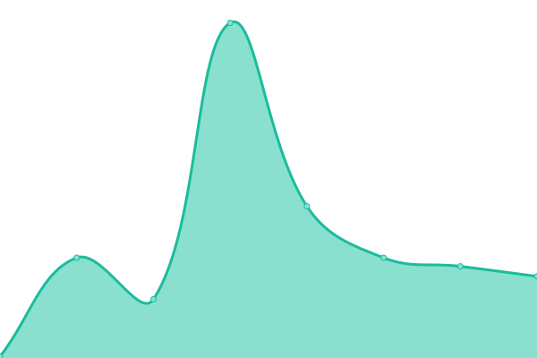

# [📈 Live Status](https://status.micway.com.au): <!--live status--> **🟧 Partial outage**

This repository contains the open-source uptime monitor and status page for [Micway Transport](https://status.micway.com.au), powered by [Upptime](https://github.com/upptime/upptime).

With [Upptime](https://upptime.js.org), you can get your own unlimited and free uptime monitor and status page, powered entirely by a GitHub repository. We use [Issues](https://github.com/micway/healthcheck/issues) as incident reports, [Actions](https://github.com/micway/healthcheck/actions) as uptime monitors, and [Pages](https://status.micway.com.au) for the status page.

<!--start: status pages-->
<!-- This summary is generated by Upptime (https://github.com/upptime/upptime) -->
<!-- Do not edit this manually, your changes will be overwritten -->
<!-- prettier-ignore -->
| URL | Status | History | Response Time | Uptime |
| --- | ------ | ------- | ------------- | ------ |
|  PALLET LOADER (API) | 🟩 Up | [pallet-loader-api.yml](https://github.com/micway/healthcheck/commits/HEAD/history/pallet-loader-api.yml) | 

 803ms
     
 | 

<a href="https://status.micway.com.au/history/pallet-loader-api">100.00%</a>
    

|  TMS (Website) | 🟩 Up | [tms-website.yml](https://github.com/micway/healthcheck/commits/HEAD/history/tms-website.yml) | 

 204ms
     
 | 

<a href="https://status.micway.com.au/history/tms-website">100.00%</a>
    

|  TMS (API) | 🟩 Up | [tms-api.yml](https://github.com/micway/healthcheck/commits/HEAD/history/tms-api.yml) | 

 708ms
     
 | 

<a href="https://status.micway.com.au/history/tms-api">100.00%</a>
    

|  TMS (Server) | 🟥 Down | [tms-server.yml](https://github.com/micway/healthcheck/commits/HEAD/history/tms-server.yml) | 

 0ms
     
 | 

<a href="https://status.micway.com.au/history/tms-server">0.00%</a>
    

|  TMS (Database) | 🟥 Down | [tms-database.yml](https://github.com/micway/healthcheck/commits/HEAD/history/tms-database.yml) | 

 0ms
     
 | 

<a href="https://status.micway.com.au/history/tms-database">0.00%</a>
    

|  BUNDY CLOCK (API) | 🟩 Up | [bundy-clock-api.yml](https://github.com/micway/healthcheck/commits/HEAD/history/bundy-clock-api.yml) | 

 722ms
     
 | 

<a href="https://status.micway.com.au/history/bundy-clock-api">100.00%</a>
    

|  AMC INTEGRATION (API) | 🟩 Up | [amc-integration-api.yml](https://github.com/micway/healthcheck/commits/HEAD/history/amc-integration-api.yml) | 

 686ms
     
 | 

<a href="https://status.micway.com.au/history/amc-integration-api">100.00%</a>
    

|  TRACKING (Server) | 🟥 Down | [tracking-server.yml](https://github.com/micway/healthcheck/commits/HEAD/history/tracking-server.yml) | 

 0ms
     
 | 

<a href="https://status.micway.com.au/history/tracking-server">0.00%</a>
    

|  CRON REPORTS (API) | 🟩 Up | [cron-reports-api.yml](https://github.com/micway/healthcheck/commits/HEAD/history/cron-reports-api.yml) | 

 1250ms
     
 | 

<a href="https://status.micway.com.au/history/cron-reports-api">99.81%</a>
    

|  [MICWAY (Website)](https://www.micway.com.au) | 🟩 Up | [micway-website.yml](https://github.com/micway/healthcheck/commits/HEAD/history/micway-website.yml) | 

 80ms
     
 | 

<a href="https://status.micway.com.au/history/micway-website">100.00%</a>
    

|  [OUTLOOK](https://outlook.office365.com/owa/) | 🟩 Up | [outlook.yml](https://github.com/micway/healthcheck/commits/HEAD/history/outlook.yml) | 

 219ms
     
 | 

<a href="https://status.micway.com.au/history/outlook">93.64%</a>
    

|  [MICROSOFT (Authentication)](https://login.microsoftonline.com) | 🟩 Up | [microsoft-authentication.yml](https://github.com/micway/healthcheck/commits/HEAD/history/microsoft-authentication.yml) | 

 265ms
     
 | 

<a href="https://status.micway.com.au/history/microsoft-authentication">100.00%</a>
    

|  [OFFICE 365](https://graph.microsoft.com) | 🟩 Up | [office-365.yml](https://github.com/micway/healthcheck/commits/HEAD/history/office-365.yml) | 

 207ms
     
 | 

<a href="https://status.micway.com.au/history/office-365">100.00%</a>
    

|  [AZURE](https://azure.status.microsoft) | 🟩 Up | [azure.yml](https://github.com/micway/healthcheck/commits/HEAD/history/azure.yml) | 

 381ms
     
 | 

<a href="https://status.micway.com.au/history/azure">100.00%</a>
    

<!--end: status pages-->

[**Visit our status website →**](https://status.micway.com.au)

## 📄 License

- Powered by: [Upptime](https://github.com/upptime/upptime)
- Code: [MIT](./LICENSE) © [Anand Chowdhary](https://anandchowdhary.com), supported by [Pabio](https://pabio.com)
- Data in the `./history` directory: [Open Database License](https://opendatacommons.org/licenses/odbl/1-0/)
